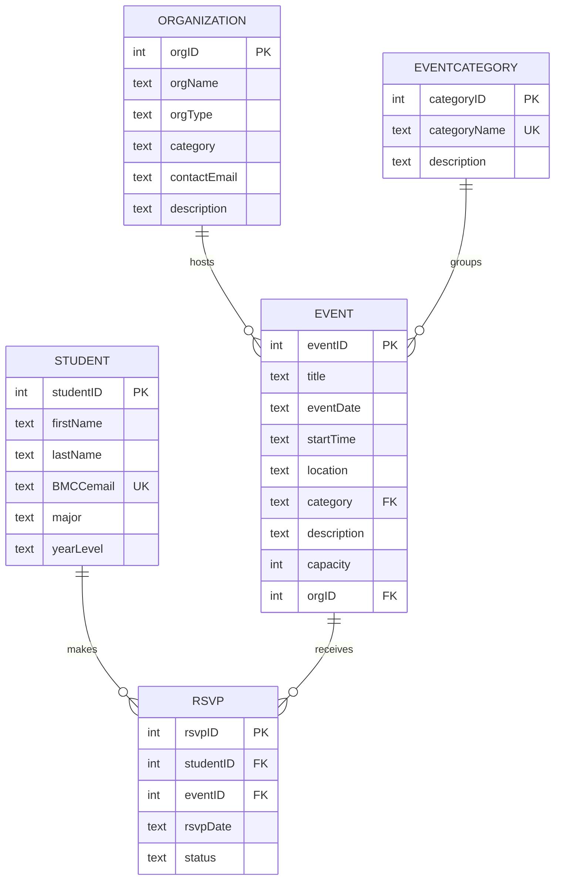

# Mermaid ER Diagram

## Primary Key and Foreign Key Explanation

A primary key uniquely identifies each row in a table. For example, `studentID` uniquely identifies each student, and `eventID` uniquely identifies each event.

A foreign key connects one table to another table. For example, `Event.orgID` connects each event to the organization that hosts it. `RSVP.studentID` connects an RSVP to a student, and `RSVP.eventID` connects an RSVP to an event.

The RSVP table works as an associative table because students and events have a many-to-many relationship. One student can RSVP to many events, and one event can have many students.
