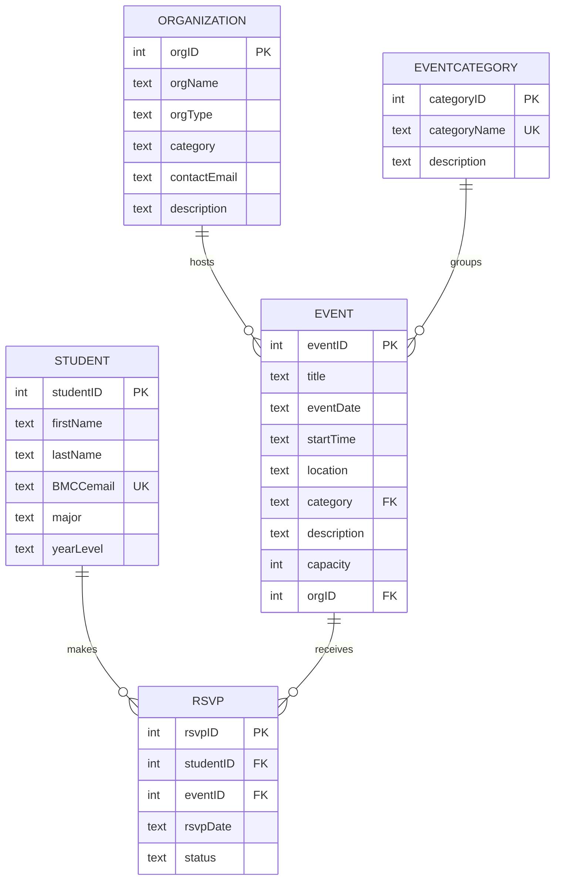

# BMCC CampusConnect

## Project Purpose
BMCC CampusConnect is a database-driven web application prototype for CIS 395 Database Systems I. It helps new BMCC students discover campus organizations, clubs, resources, and events. Students can browse events and organizations, RSVP to events, update RSVP status, and cancel RSVPs.

This is an academic prototype and not an official BMCC platform.

## Theme Connection
This project connects to the STEM Innovation Challenge theme **New Student Community**. It helps new students connect with clubs, campus resources, mentorship opportunities, STEM/AI events, and student support services.

## Technologies Used
- Python
- Flask
- SQLite
- HTML
- CSS
- Jinja templates

## Database Tables
1. `Student`
2. `Organization`
3. `EventCategory`
4. `Event`
5. `RSVP`

## Key Relationships
- One Organization can host many Events.
- One Event belongs to one Organization.
- One Student can RSVP to many Events.
- One Event can have many Student RSVPs.
- RSVP connects Student and Event.
- Events are grouped by category.

## How to Run the Project

### 1. Install Flask
```bash
pip install Flask
```

### 2. Run the application
```bash
python app.py
```

### 3. Open in browser
```text
http://127.0.0.1:5000
```

The app creates `database.db` automatically from `schema.sql` the first time it runs.

## CRUD Features
The application supports:
- Insert new records
- Retrieve and display records
- Update existing records
- Delete records

CRUD is available for:
- Students
- Organizations
- Events
- RSVPs

## Sample Report Queries

### Total RSVPs per event
```sql
SELECT e.title, COUNT(r.rsvpID) AS totalRSVPs
FROM Event e
LEFT JOIN RSVP r ON e.eventID = r.eventID
GROUP BY e.eventID, e.title;
```

### Seats left per event
```sql
SELECT e.title, e.capacity,
       e.capacity - COUNT(r.rsvpID) AS seatsLeft
FROM Event e
LEFT JOIN RSVP r ON e.eventID = r.eventID AND r.status = 'Confirmed'
GROUP BY e.eventID, e.title, e.capacity;
```

### Events by category
```sql
SELECT category, COUNT(*) AS eventCount
FROM Event
GROUP BY category;
```

### Events hosted by each organization
```sql
SELECT o.orgName, COUNT(e.eventID) AS eventCount
FROM Organization o
LEFT JOIN Event e ON o.orgID = e.orgID
GROUP BY o.orgID, o.orgName;
```

## Mermaid ER Diagram

